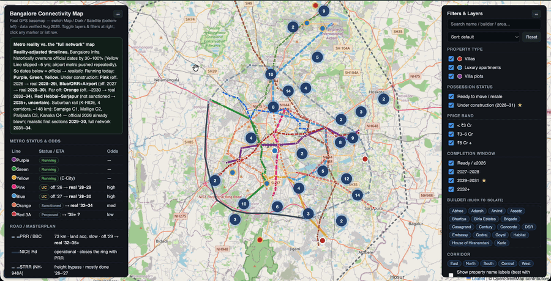

# Bangalore Connectivity & Real-Estate Map

An interactive map of Bengaluru's **future public-transport network** — Namma Metro, K-RIDE suburban rail, and the ring roads (PRR/BBC, NICE, STRR) — overlaid with **150+ Tier-1/1.5/2 residential projects** (villas, apartments, plots) from the major developers.

It was built to answer one question: **as Bangalore's infrastructure explodes over the next decade, where will it actually be good to live?**

> ⚠️ **Not investment or real-estate advice.** Station/road alignments are approximate (DPR-level), project pins are locality-level unless marked verified, and *timelines are the author's realistic estimates, not official promises*. Always verify RERA, exact GPS, and current price before making any decision. See [Data & accuracy](#data--accuracy).

## Demo



<sub>▶️ For a full-quality clip with playback controls, drag `docs/demo.mp4` into any GitHub PR/issue or the README editor and GitHub will embed a player — or host it on YouTube/Loom and link it here.</sub>

**Try it live** (after you enable GitHub Pages): `https://koundinyapavan.github.io/bangalore-connectivity-map/`

## Why this exists

Visiting Bangalore recently, it struck me how much daily life has changed. It no longer matters whether you live "in the city." Gated-community living plus instant online services (groceries, food, help, healthcare) means the neighborhood *inside* your gate is self-contained. What's left that actually matters comes down to **three things**:

1. **Commute to work** (the tech corridors)
2. **Hospitals**
3. **Schools for kids**

All three are about **connectivity**. And Bangalore is in the middle of a once-in-a-generation infrastructure build-out — three operational metro lines with several more coming, a brand-new four-corridor suburban rail network, and ring roads designed to bypass today's worst bottlenecks. Only after mapping it all together did the *future* shape of the city become obvious — and where the Tier-1/1.5/2 projects sit relative to that future network.

This tool makes that future visible.

## What it shows

- **Namma Metro** — operational (Purple/Green/Yellow) + under-construction & planned lines, with **realistic** (history-adjusted) ETAs, not just official ones.
- **K-RIDE suburban rail** — all four corridors (Sampige C1, Mallige C2, Parijaata C3, Kanaka C4) with station lists.
- **Ring roads** — the corrected **Peripheral Ring Road / Bengaluru Business Corridor** (73 km, ties into NICE at both ends), **NICE Road**, and the outer **STRR**, plus PRR interchanges.
- **150+ residential projects** — villas, luxury apartments and villa plots from Prestige, Sobha, Brigade, Godrej, Puravankara, Adarsh, Embassy, Total Environment, Assetz, Sattva, Birla, L&T, Lodha, and more.
- **Context layers** — tech-hub commute buffers (5 & 10 km), international schools, multispecialty hospitals, and today's traffic bottlenecks.

### Features

- 🗺️ Switchable basemaps — **Map** (OpenStreetMap), **Dark**, and **Satellite** (great for eyeballing the actual plot, tree cover, and nearby lakes).
- 🔴 **Marker clustering** so the map stays readable at city zoom.
- 🔎 **Search** + filter by **type, price band, possession, completion window, builder, and corridor**.
- ↕️ **Sort** by price or completion date; click a pin to highlight its list row and vice-versa.
- ⭐ A gold ring marks **upcoming (under-construction) projects** you can enter pre-completion as the network matures.

## Run locally

No build step. It's a single self-contained file.

```bash
# clone, then just open it:
open index.html          # macOS
# or: xdg-open index.html # Linux
# or double-click index.html
```

Everything (Leaflet + marker-cluster + tiles) loads from public CDNs, so you just need an internet connection.

## Data & accuracy

- **Timelines** show `official → realistic`. Bangalore infrastructure historically overruns official dates by 30–100% (the Yellow Line slipped ~5 years), so realistic dates are deliberately conservative.
- **Transit/road paths** are schematic segments between real station/interchange coordinates — good enough to see corridors and proximity, not survey-grade.
- **Project pins** are placed at locality level (`geo: 'approx'`) unless a real GPS pin was confirmed (`geo: 'verified'`).
- **Developer possession dates** are RERA/builder targets and commonly slip 12–24 months.
- Sources: BMRCL, K-RIDE, BDA DPRs, and public developer listings (as of Aug 2026).

## Contributing

Corrections and additions are very welcome — especially accurate GPS pins, new launches, and station/alignment fixes. Please read [CONTRIBUTING.md](CONTRIBUTING.md).

This repository uses a protected `main` branch: all changes go through pull requests reviewed and approved by the maintainer.

## Roadmap ideas

- "Near a transit stop" filter (e.g. projects within ~1.5 km of an operational metro or suburban-rail station).
- Commute isochrones to major tech parks.
- Price-per-sqft and a rough affordability overlay.
- Shareable URL state (filters/zoom encoded in the link).

## License

[MIT](LICENSE) — free to use, fork, and build on.

## Author

Built by **Pavan Kaipa**. If you find it useful, a ⭐ on the repo is appreciated.
